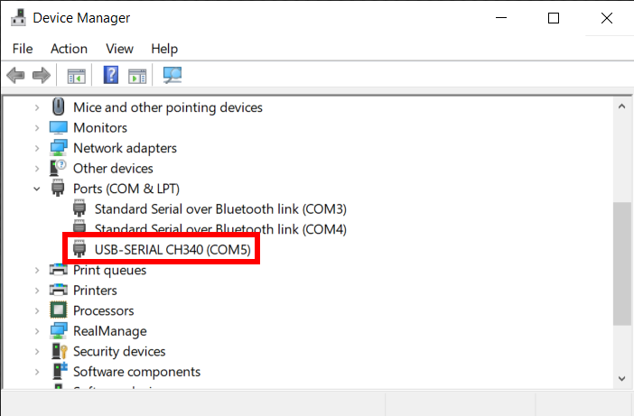
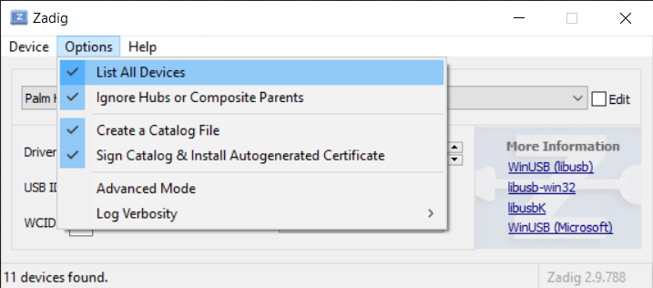
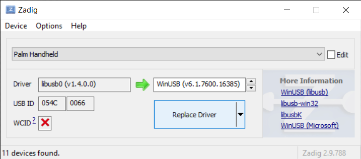

# Connecting Palm OS Devices

This document will guide you through the process of connecting a Palm OS device to your computer to perform a HotSync with [`palm-sync`](https://github.com/jichu4n/palm-sync/). Please read through the [General setup](#general-setup) section first, then follow the instructions for your specific OS.

## General setup

The following are required on all OSes:

- **Node.js**: Node.js 18.x or higher.
- **Browser**: WebUSB and/or Web Serial APIs. As of the time of writing, these APIs are available in Chromium-based browsers, such as Google Chrome and Microsoft Edge, but not in Firefox or Safari.

### Serial

#### Hardware

To connect a Palm OS device with a serial cradle or cable to a modern computer, you'll likely need a serial-to-USB adapter. These are widely available and fairly cheap (typically $5 USD or less on sites like AliExpress), and are generally supported out of the box on modern OSes.

#### Performing a HotSync

The recommended way to perform a HotSync with `palm-sync` over serial:

1. Physically connect the Palm device to the computer via serial cradle / cable and serial-to-USB adapter if needed.
2. Start `palm-sync` sync server on the computer.
   - CLI: `--serial ttyXXX` on macOS and Linux, `--serial COMn` on Windows
   - Browser: Start sync, select the serial port in the popup, and click `Connect`.
3. Start HotSync on the Palm OS device.

The order is important here. If you perform steps 2 and 3 in the reverse order, the sync will most likely fail and you may need to physically disconnect the Palm device from the computer before trying again.

#### Baud rate

Modern serial-to-USB adapters typically support baud rates up to 115200, while early Palm OS devices can only support much lower baud rates. During the initial handshake phase of a HotSync session, the Palm device and the computer negotiate the highest baud rate supported on both sides, and switch to that baud rate for the remainder of the session.

However, the negotiated baud rate may not actually work correctly on your hardware and platform. So if your serial connection stalls, try explicitly specifying a lower maximum baud rate through the API or CLI (e.g. `--maxBaudRate 9600`).

### USB

#### Performing a HotSync

The recommended way to perform a HotSync with `palm-sync` over USB:

1. Physically connect the Palm device to the computer via USB cradle / cable.
2. Start HotSync on the Palm OS device.
3. Start `palm-sync` sync server.
   - CLI: `--usb`
   - Browser: Start sync, select the Palm device in the popup, and click `Connect`.

For most Palm devices with a USB cradle / cable, steps 2 and 3 can be performed in either order. However, some models like the LifeDrive and Z22 might only work when following the order above.

### Network

TODO

## Windows

`palm-sync` supports Windows 10 and Windows 11.

- **Node.js**: Official build of Node.js 18.x or higher, installed from the Node.js website or via a tool like nvm. Node.js inside WSL is also supported.
- **Browser**: Tested in Google Chrome and Microsoft Edge. Will likely work in other Chromium-based browsers as long as WebUSB and / or Web Serial APIs are available.

### Serial

Use Device Manager to identify the port number corresponding to the serial port or serial-to-USB adapter, which should look something like `COM5`.



### USB

`palm-sync` uses either `libusb` (Node.js) or the WebUSB API (browser). In both cases, a generic WinUSB driver must be installed for the connected Palm OS device. The recommended way to install and configure the driver is to use [Zadig](http://zadig.akeo.ie/). See [libusb documentation](https://github.com/libusb/libusb/wiki/Windows#driver-installation) for more information.

To set up a Palm device using Zadig:

- Install Zadig on the computer and launch it.
- Select `Options` > `List All Devices` from the menu: 
- Connect the Palm device to the computer via USB cradle / cable.
- Start HotSync on the Palm device. This is necessary because most Palm devices won't actually show up on the computer until you start a HotSync.
- In Zadig, select the Palm device, select the WinUSB driver, and click on `Replace Driver`. It's normal for this step to take a while and it's okay if the Palm device disconnects during the process. 
- The Palm device should be automatically mapped to the WinUSB driver on subsequent connections. However, you should keep Zadig around in case the driver needs to be replaced again.

You can now start HotSync on the Palm device, and run `palm-sync` in Node.js or the browser. If the WinUSB driver is correctly installed for the device, `palm-sync` should now be able to detect and communicate with it.

### WSL

You can forward the relevant USB device (either the Palm device or the serial-to-USB adapter) to a Linux distribution inside WSL, then run `palm-sync` just like on regular Linux.

- See [Microsoft documentation](https://learn.microsoft.com/en-us/windows/wsl/connect-usb) for detailed instructions on forwarding USB devices to WSL.
- See the [Linux section below](#linux) for instructions on setting up `palm-sync` on Linux.

Caveat: WSL does not support forwarding actual serial ports. So if you want to use WSL with a Palm device that has a serial cradle / cable, you will need to use a USB-to-serial adapter.

## macOS

`palm-sync` should work on macOS 10.15 Catalina and later, and on both Intel and Apple Silicon.

- **Node.js**: Official build of Node.js 18.x or higher, installed from the Node.js website or via Homebrew.
- **Browser**: Tested in Google Chrome. Will likely work in other Chromium-based browsers as long as WebUSB and / or Web Serial APIs are available.

### Serial

Use `ls /dev/tty.*` to identify the device corresponding to your serial-to-USB adapter. The device will typically look something like `/dev/tty.usbserial-XXXX`, such as `/dev/tty.usbserial-2240` in the example below:

```
$ ls -l /dev/tty.*
crw-rw-rw- 1 root wheel 9, 2 Jul  4 00:48 /dev/tty.Bluetooth-Incoming-Port
crw-rw-rw- 1 root wheel 9, 4 Jul 14 22:24 /dev/tty.usbserial-2240
crw-rw-rw- 1 root wheel 9, 0 Jul  4 00:47 /dev/tty.wlan-debug
```

### USB

Palm devices with a USB cradle / cable should work out of the box on macOS.

## Linux

`palm-sync` should work on most modern Linux distributions.

- **Node.js**: Node.js 18.x or higher, installed via package manager or a tool like nvm.
- **Browser**: Tested in Google Chrome. Will likely work in other Chromium-based browsers as long as WebUSB and / or Web Serial APIs are available.

### Serial

Use `ls -l /dev/ttyUSB*` to identify the device corresponding to your serial-to-USB adapter, which will typically look something like `/dev/ttyUSB0`.

```
$ ls -l /dev/ttyUSB*
crw-rw---- 1 root uucp 188, 0 Jul 14 22:08 /dev/ttyUSB0
```

Depending on the distribution, permission to access serial devices may be controlled by a user group such as `dialout` or `uucp`. For example, in the above output we see that non-root users must be in the `uucp` group in order to access `/dev/ttyUSB0`. You'll need to add your regular user to that group, and log out and back in (or reboot) for the change to take effect.

### USB

To set up your Linux environment to sync with Palm devices over USB using `palm-sync`, you'll need to perform the following steps:

#### 1. Blacklist `visor` module

Copy [`blacklist-visor.conf`](https://github.com/jichu4n/palm-sync/blob/master/blacklist-visor.conf) from this repo to `/etc/modprobe.d/`.

Then, run `sudo modprobe -r visor` to ensure the module is not already loaded.

**Why**: The `visor` module is an ancient Linux kernel module that presents a serial interface for Palm OS devices. This driver may interfere with `palm-sync`, so it's recommended to blacklist it from being loaded when a Palm device is connected.

#### 2. Add `udev` rules

Copy [`60-palm-os-devices.rules`](https://github.com/jichu4n/palm-sync/blob/master/60-palm-os-devices.rules) from this repo to `/etc/udev/rules.d/`.

Then, run the following command (or just reboot) for the rules to take effect:

```
sudo udevadm control --reload-rules && sudo udevadm trigger
```

**Why**: These `udev` rules allow non-root users to connect to Palm OS devices without `sudo`. On Linux, only the root user can directly access USB devices by default. These `udev` rules specify a list of known Palm OS devices, and grant access to non-root users when a matching device is connected.

## ChromeOS

TODO

## Android

TODO
